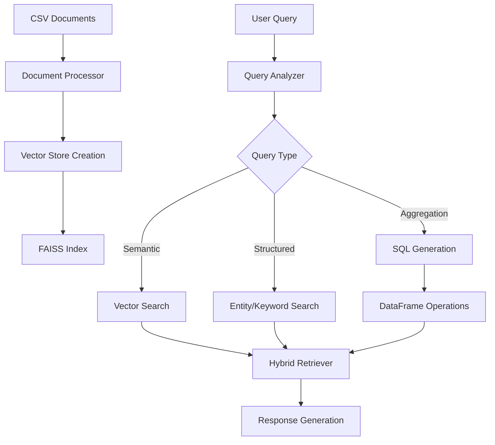

# Advanced RAG System with Hybrid Retrieval

## Overview

A sophisticated Retrieval-Augmented Generation (RAG) system designed for enterprise document management and intelligent information retrieval. The system combines semantic search with structured querying capabilities, supporting multiple data sources and providing intelligent query processing with SQL generation for aggregation tasks.

## Key Features

###  Hybrid Retrieval Engine
- **Semantic Search**: Vector-based similarity search using Cohere embeddings
- **Structured Search**: Entity and keyword-based retrieval with relevance scoring
- **Adaptive Strategy**: Automatically selects optimal retrieval method based on query analysis
- **Multi-table Support**: Search across multiple CSV data sources simultaneously

###  Advanced Query Processing
- **Query Analysis**: Intelligent classification of query types (specific, aggregation, comparison)
- **Entity Extraction**: Automatic identification of names, IDs, barcodes, emails, and dates
- **SQL Generation**: LLM-powered SQL query generation for complex aggregations
- **Table Selection**: Smart selection of relevant data sources for multi-table queries

###  Production-Ready Features
- **Rate Limiting**: Built-in API quota management for Cohere services
- **Error Handling**: Robust error recovery and fallback mechanisms
- **Encoding Detection**: Automatic handling of various file encodings
- **Batch Processing**: Memory-efficient processing of large datasets
- **Evaluation System**: Comprehensive retrieval and generation quality assessment

## Architecture

### Core Components

1. **Document Processor** (`document_processor.py`)
   - CSV file ingestion with encoding detection
   - Text chunking and preprocessing
   - Vector store creation and management
   - Rate-limited API interactions

2. **Hybrid Retriever** (`retrieval.py`)
   - Multi-strategy retrieval engine
   - Query analysis and optimization
   - SQL query generation for aggregations
   - Result formatting and deduplication

3. **Generation Orchestrator** (referenced in retrieval system)
   - LLM integration for response generation
   - Context-aware answer synthesis
   - Evaluation and feedback collection

### Data Flow



## Installation

### Prerequisites
- Python 3.8+
- Cohere API key
- Required Python packages (see requirements.txt)

### Setup

1. **Clone the repository**
```bash
git clone <repository-url>
cd advanced-rag-system
```

2. **Install dependencies**
```bash
pip install -r requirements.txt
```

3. **Configure API keys**
```bash
# Set environment variable
export COHERE_API_KEY="your_cohere_api_key_here"

# Or update config.py
COHERE_API_KEY = "your_cohere_api_key_here"
```

4. **Prepare your data**
```bash
# Place CSV files in data/documents/
mkdir -p data/documents
cp your_csv_files.csv data/documents/
```

5. **Create vector store**
```python
from document_processor import run_quota_aware_processing

# Process documents with quota awareness
processor = run_quota_aware_processing(
    folder_path="./data/documents",
    max_rows_per_file=100,  # Adjust based on your API quota
    is_trial_key=True       # Set False for production keys
)
```

## Usage

### Basic Query Interface

```python
from retrieval import HybridRetriever

# Initialize retriever
retriever = HybridRetriever()

# Simple query
results = retriever.simple_query("show cartons with taxes foncieres", top_k=5)

# Query with options
results = retriever.simple_query(
    query="count users by department",
    strategy="aggregation",
    display_mode="full",
    top_k=10
)
```

### Interactive Mode

```python
from retrieval import test_retrieval_system

# Start interactive session
test_retrieval_system()
```

Available commands in interactive mode:
- `tables` - Show available data tables
- `explain <query>` - Analyze query strategy
- `table <name> <query>` - Search specific table
- `full <query>` - Show all columns
- `help` - Show help information

### Advanced Query Configuration

```python
from retrieval import QueryRequest

# Create detailed query request
query_request = QueryRequest(
    query="show document status by user",
    top_k=10,
    retrieval_strategy="hybrid",
    display_mode="smart",
    table_filter="document_table",
    min_score=0.3,
    include_metadata=True,
    explain_results=True
)

# Process query
response = retriever.process_query(query_request)
```

### Batch Processing

```python
queries = [
    "show recent documents",
    "count users by status",
    "find documents with tax information"
]

results = retriever.batch_query(queries, top_k=3, strategy="auto")
```

## Query Types and Capabilities

### 1. Specific Searches
Find exact documents or entities:
```python
# Find specific documents
"show document P056186473"
"find user APYR5460"
"get cartons with barcode 123456789"
```

### 2. Aggregation Queries
Generate SQL for complex aggregations:
```python
# Count and group operations
"count documents by user"
"sum taxes by region"
"average document processing time"
"show document distribution by year"
```

### 3. Status and Filtering
Query with conditions:
```python
# Status queries
"show active documents"
"find documents created in 2023"
"get pending approval requests"
```

### 4. General Information
Semantic similarity searches:
```python
# Conceptual queries
"what is document management"
"explain archival process"
"document lifecycle information"
```

## Configuration

### Environment Variables
```bash
COHERE_API_KEY=your_api_key
VECTOR_DB_PATH=./data/vector_store
CHUNK_SIZE=1000
CHUNK_OVERLAP=200
EMBEDDING_MODEL=embed-multilingual-v3.0
```

### Rate Limiting
The system includes built-in rate limiting for API calls:

```python
# Trial key limits
max_requests_per_minute = 90
max_monthly_calls = 1000

# Production key limits  
max_requests_per_minute = 1800
max_monthly_calls = 999999
```

### Processing Limits
Control resource usage during vector store creation:

```python
# Quota-aware processing
processor = DocumentProcessor(is_trial_key=True)
vector_store = processor.create_incremental_vector_store(
    folder_path="./data/documents",
    max_rows_per_file=50,      # Limit rows per file
    chunks_per_batch=25        # Process in smaller batches
)
```

## Data Format Requirements

### CSV File Structure
The system processes CSV files with the following considerations:

- **Encoding**: Automatic detection of UTF-8, ISO-8859-1, CP1252
- **Headers**: First row treated as column names
- **Content**: All columns combined into searchable text
- **Metadata**: File source, row indices, and encoding preserved

### Example CSV Format
```csv
nom,prenom,codebarre,status,date_creation
Dupont,Jean,P056186473,active,2023-01-15
Martin,Marie,P056186474,pending,2023-01-16
```

### Supported Column Types
- **Identity**: id, name, nom, prenom, codebarre
- **Contact**: email, phone, address
- **Temporal**: date, time, year, created
- **Financial**: price, amount, salary, taxes
- **Location**: city, country, region
- **Status**: status, type, category, active

## Performance and Monitoring

### Processing Statistics
The system tracks comprehensive processing metrics:

```python
# Get processing statistics
stats = processor.get_processing_stats()
print(f"Documents processed: {stats['processed_files']}")
print(f"API calls made: {stats['api_calls_made']}")
print(f"Processing time: {stats['processing_time']:.1f}s")
```

### Query Performance
Monitor retrieval performance:

```python
# Explain retrieval strategy
explanation = retriever.explain_retrieval("your query")
print(f"Strategy: {explanation['strategy_chosen']}")
print(f"Confidence: {explanation['analysis']['confidence']}")
```

### Memory Management
- Batch processing for large datasets
- Chunked CSV reading
- Incremental vector store creation
- Configurable chunk sizes

## Error Handling

The system includes robust error handling for:

- **Encoding Issues**: Automatic fallback encoding detection
- **API Rate Limits**: Built-in waiting and retry logic  
- **Memory Constraints**: Batch processing and chunking
- **File Format Errors**: Graceful handling of malformed CSV files
- **Network Issues**: Retry mechanisms for API calls

## Troubleshooting

### Common Issues

1. **Vector Store Not Found**
```bash
Error: Vector store not found at ./data/vector_store
Solution: Run document processing first to create vector store
```

2. **API Quota Exceeded**
```bash
Error: Monthly API limit exceeded
Solution: Wait for quota reset or upgrade API plan
```

3. **Encoding Errors**
```bash
Error: UnicodeDecodeError when reading CSV
Solution: System automatically detects and handles encoding
```

4. **Memory Issues**
```bash
Error: Out of memory during processing
Solution: Reduce max_rows_per_file or chunks_per_batch
```

### Debug Mode
Enable detailed logging:

```python
import logging
logging.basicConfig(level=logging.INFO)

# Run with debug information
retriever = HybridRetriever()
results = retriever.retrieve("query", explain_results=True)
```

## Contributing

1. Fork the repository
2. Create a feature branch (`git checkout -b feature/amazing-feature`)
3. Commit changes (`git commit -m 'Add amazing feature'`)
4. Push to branch (`git push origin feature/amazing-feature`)
5. Open a Pull Request


## Acknowledgments

- Cohere AI for embedding and language model APIs
- LangChain for document processing utilities
- FAISS for efficient vector similarity search
- Pandas for data manipulation and processing
