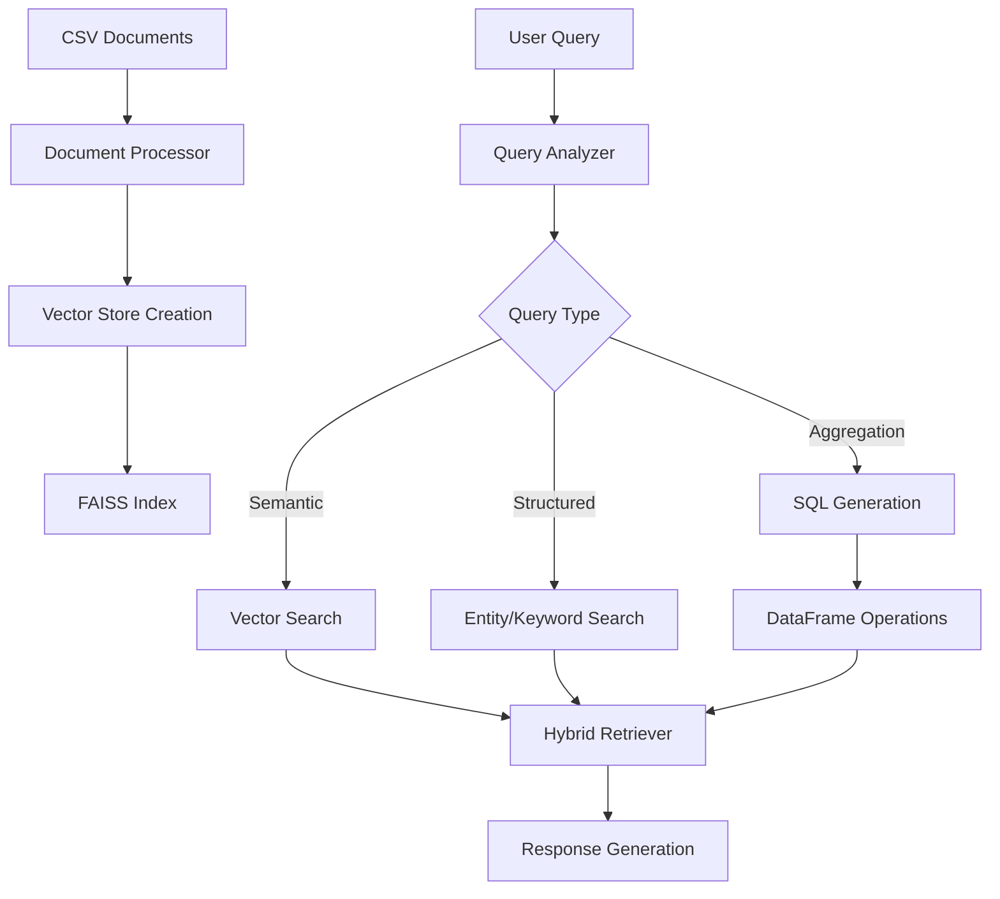
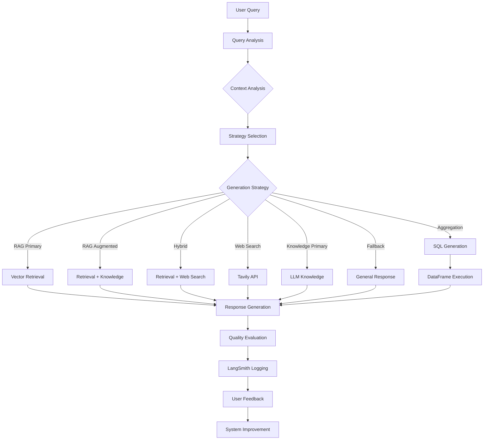

# Advanced RAG System with Intelligent Generation Orchestration

## Overview

A sophisticated Retrieval-Augmented Generation (RAG) system designed for enterprise document management and intelligent information retrieval. The system features a smart generation orchestrator that automatically selects optimal response strategies, comprehensive evaluation capabilities, and integrated feedback management with LangSmith tracking.

## Key Features
###  Hybrid Retrieval Engine
- **Semantic Search**: Vector-based similarity search using Cohere embeddings
- **Structured Search**: Entity and keyword-based retrieval with relevance scoring
- **Adaptive Strategy**: Automatically selects optimal retrieval method based on query analysis
- **Multi-table Support**: Search across multiple CSV data sources simultaneously
- 
###  Smart Generation Orchestration
- **Strategy-Based Generation**: Automatically selects from 7 different generation strategies based on query analysis
- **Context-Aware Processing**: Analyzes relevance levels, temporal requirements, and conceptual nature of queries
- **Hybrid Approaches**: Combines RAG, web search, and knowledge-based generation as needed
- **SQL Query Generation**: Automated SQL generation and execution for aggregation queries


###  Advanced Evaluation & Monitoring
- **Automated Quality Assessment**: Hallucination detection, relevance, completeness, and accuracy scoring
- **LangSmith Integration**: Comprehensive logging and tracking of all interactions
- **User Feedback Collection**: Streamlit-based feedback widgets with LangSmith integration
- **Performance Metrics**: Real-time evaluation and reporting

###  Production-Ready Features
- **Rate Limiting**: Built-in API quota management for Cohere services
- **Error Handling**: Robust error recovery and fallback mechanisms
- **Batch Processing**: Memory-efficient processing of large datasets
- **Web Search Integration**: Tavily API integration for current information needs


#  1- Hybrid Retrieval

## Overview

A sophisticated Retrieval-Augmented Generation (RAG) system designed for enterprise document management and intelligent information retrieval. The system combines semantic search with structured querying capabilities, supporting multiple data sources and providing intelligent query processing with SQL generation for aggregation tasks.

## Key Features

###  Hybrid Retrieval Engine
- **Semantic Search**: Vector-based similarity search using Cohere embeddings
- **Structured Search**: Entity and keyword-based retrieval with relevance scoring
- **Adaptive Strategy**: Automatically selects optimal retrieval method based on query analysis
- **Multi-table Support**: Search across multiple CSV data sources simultaneously

###  Advanced Query Processing
- **Query Analysis**: Intelligent classification of query types (specific, aggregation, comparison)
- **Entity Extraction**: Automatic identification of names, IDs, barcodes, emails, and dates
- **SQL Generation**: LLM-powered SQL query generation for complex aggregations
- **Table Selection**: Smart selection of relevant data sources for multi-table queries

###  Production-Ready Features
- **Rate Limiting**: Built-in API quota management for Cohere services
- **Error Handling**: Robust error recovery and fallback mechanisms
- **Encoding Detection**: Automatic handling of various file encodings
- **Batch Processing**: Memory-efficient processing of large datasets
- **Evaluation System**: Comprehensive retrieval and generation quality assessment

## Architecture

### Core Components

1. **Document Processor** (`document_processor.py`)
   - CSV file ingestion with encoding detection
   - Text chunking and preprocessing
   - Vector store creation and management
   - Rate-limited API interactions

2. **Hybrid Retriever** (`retrieval.py`)
   - Multi-strategy retrieval engine
   - Query analysis and optimization
   - SQL query generation for aggregations
   - Result formatting and deduplication

3. **Generation Orchestrator** (referenced in retrieval system)
   - LLM integration for response generation
   - Context-aware answer synthesis
   - Evaluation and feedback collection

### Data Flow



## Installation

### Prerequisites
- Python 3.8+
- Cohere API key
- Required Python packages (see requirements.txt)

### Setup

1. **Clone the repository**
```bash
git clone <repository-url>
cd advanced-rag-system
```

2. **Install dependencies**
```bash
pip install -r requirements.txt
```

3. **Configure API keys**
```bash
# Set environment variable
export COHERE_API_KEY="your_cohere_api_key_here"

# Or update config.py
COHERE_API_KEY = "your_cohere_api_key_here"
```

4. **Prepare your data**
```bash
# Place CSV files in data/documents/
mkdir -p data/documents
cp your_csv_files.csv data/documents/
```

5. **Create vector store**
```python
from document_processor import run_quota_aware_processing

# Process documents with quota awareness
processor = run_quota_aware_processing(
    folder_path="./data/documents",
    max_rows_per_file=100,  # Adjust based on your API quota
    is_trial_key=True       # Set False for production keys
)
```

## Usage

### Basic Query Interface

```python
from retrieval import HybridRetriever

# Initialize retriever
retriever = HybridRetriever()

# Simple query
results = retriever.simple_query("show cartons with taxes foncieres", top_k=5)

# Query with options
results = retriever.simple_query(
    query="count users by department",
    strategy="aggregation",
    display_mode="full",
    top_k=10
)
```

### Interactive Mode

```python
from retrieval import test_retrieval_system

# Start interactive session
test_retrieval_system()
```

Available commands in interactive mode:
- `tables` - Show available data tables
- `explain <query>` - Analyze query strategy
- `table <name> <query>` - Search specific table
- `full <query>` - Show all columns
- `help` - Show help information

### Advanced Query Configuration

```python
from retrieval import QueryRequest

# Create detailed query request
query_request = QueryRequest(
    query="show document status by user",
    top_k=10,
    retrieval_strategy="hybrid",
    display_mode="smart",
    table_filter="document_table",
    min_score=0.3,
    include_metadata=True,
    explain_results=True
)

# Process query
response = retriever.process_query(query_request)
```

### Batch Processing

```python
queries = [
    "show recent documents",
    "count users by status",
    "find documents with tax information"
]

results = retriever.batch_query(queries, top_k=3, strategy="auto")
```

## Query Types and Capabilities

### 1. Specific Searches
Find exact documents or entities:
```python
# Find specific documents
"show document P056186473"
"find user APYR5460"
"get cartons with barcode 123456789"
```

### 2. Aggregation Queries
Generate SQL for complex aggregations:
```python
# Count and group operations
"count documents by user"
"sum taxes by region"
"average document processing time"
"show document distribution by year"
```

### 3. Status and Filtering
Query with conditions:
```python
# Status queries
"show active documents"
"find documents created in 2023"
"get pending approval requests"
```

### 4. General Information
Semantic similarity searches:
```python
# Conceptual queries
"what is document management"
"explain archival process"
"document lifecycle information"
```


# 2- Genertion
## Architecture

### Core Components

1. **Generation Orchestrator** (`generation.py`)
   - Smart strategy selection engine
   - Context analysis and decision making
   - Multi-modal response generation
   - SQL execution capabilities

2. **Evaluation System** (`evaluation.py`)
   - Automated quality assessment
   - LangSmith logging and tracking
   - Performance monitoring
   - User feedback integration

3. **Feedback Manager** (`feedback_manager.py`)
   - Streamlit feedback widgets
   - LangSmith feedback submission
   - User experience tracking

4. **Hybrid Retriever** (referenced system)
   - Multi-strategy retrieval engine
   - Query analysis and optimization
   - Document processing and indexing

### Generation Strategies

The system uses 7 distinct generation strategies:

| Strategy | When Used | Description |
|----------|-----------|-------------|
| **RAG Primary** | High relevance + non-temporal | Uses retrieved information as primary source |
| **RAG Augmented** | Medium relevance | Combines retrieved info with general knowledge |
| **Hybrid** | High relevance + temporal | Combines RAG with current web information |
| **Web Search** | Temporal only | Uses real-time web search results |
| **Knowledge Primary** | Conceptual only | Relies on pretrained knowledge |
| **Aggregation** | SQL queries needed | Generates and executes SQL on data |
| **Fallback** | Low relevance/unclear | General response approach |

### Data Flow



## Installation

### Prerequisites
- Python 3.8+
- Cohere API key
- LangSmith API key (optional)
- Tavily API key (for web search)

### Setup

1. **Clone and install**
```bash
git clone <repository-url>
cd advanced-rag-system
pip install -r requirements.txt
```

2. **Configure API keys in `config.py`**
```python
COHERE_API_KEY = "your_cohere_api_key"
LANGSMITH_API_KEY = "your_langsmith_key"  # Optional
TAVILY_API_KEY = "your_tavily_key"       # Optional
LANGSMITH_PROJECT = "rag-evaluation"      # Optional
```

3. **Prepare data and create vector store**
```python
from document_processor import run_quota_aware_processing

# Process your CSV documents
processor = run_quota_aware_processing(
    folder_path="./data/documents",
    max_rows_per_file=100,
    is_trial_key=True
)
```

## Usage

### Basic Query Processing

```python
from generation import SmartGenerationOrchestrator, CohereLLMClient
from retrieval import HybridRetriever

# Initialize components
retriever = HybridRetriever()
llm_client = CohereLLMClient()
orchestrator = SmartGenerationOrchestrator(retriever, llm_client)

# Process query with automatic strategy selection
result = await orchestrator.process_query("show cartons with taxes foncieres")

print(f"Strategy: {result['strategy']}")
print(f"Answer: {result['answer']}")
print(f"Confidence: {result['confidence']}")
```

### Enhanced Processing with Evaluation

```python
# Process with full evaluation and logging
result = await orchestrator.process_query_with_evaluation(
    "count documents by user department"
)

# Access evaluation metrics
evaluation = result.get('evaluation', {})
print(f"Relevance Score: {evaluation.get('relevance_score', 0):.2f}")
print(f"Accuracy Score: {evaluation.get('accuracy_score', 0):.2f}")
print(f"Overall Score: {evaluation.get('overall_score', 0):.2f}")

# LangSmith run ID for feedback linking
run_id = result.get('langsmith_run_id')
```

### SQL Aggregation Queries

```python
# Automatic SQL generation and execution
result = await orchestrator.process_query("count total documents by status")

# Access SQL details
sql_details = result.get('sql_details', {})
print(f"Generated SQL: {result.get('generated_sql')}")
print(f"Execution Time: {sql_details.get('execution_time', 0):.3f}s")
print(f"Rows Returned: {sql_details.get('rows_returned', 0)}")
```

### Interactive Testing

```python
from generation import test_generation_orchestrator

# Start interactive testing session
test_generation_orchestrator()
```

## Streamlit Integration

### Feedback Widget Implementation

```python
from feedback_manager import FeedbackManager, StreamlitFeedbackWidget
import streamlit as st

# Initialize feedback system
feedback_manager = FeedbackManager()
feedback_widget = StreamlitFeedbackWidget(feedback_manager)

# Render feedback widget
feedback_result = feedback_widget.render_feedback_widget(
    query="user query here",
    answer="system response here",
    run_id=result.get('langsmith_run_id')
)
```

### Complete Streamlit App Structure

```python
class StreamlitRAGApp:
    def __init__(self):
        self.orchestrator = SmartGenerationOrchestrator(
            retriever=HybridRetriever(),
            llm_client=CohereLLMClient()
        )
        self.feedback_manager = FeedbackManager()
        self.feedback_widget = StreamlitFeedbackWidget(self.feedback_manager)
    
    def run(self):
        st.title("Advanced RAG System")
        
        query = st.text_input("Enter your question:")
        
        if st.button("Ask"):
            with st.spinner("Processing..."):
                result = await self.orchestrator.process_query_with_evaluation(query)
                
                # Display response
                st.subheader("Response")
                st.write(result['answer'])
                
                # Show strategy and metrics
                col1, col2 = st.columns(2)
                with col1:
                    st.metric("Strategy", result['strategy'])
                    st.metric("Confidence", f"{result['confidence']:.2f}")
                
                with col2:
                    eval_metrics = result.get('evaluation', {})
                    st.metric("Overall Score", f"{eval_metrics.get('overall_score', 0):.2f}")
                    st.metric("Relevance", f"{eval_metrics.get('relevance_score', 0):.2f}")
                
                # Feedback widget
                self.feedback_widget.render_feedback_widget(
                    query=query,
                    answer=result['answer'],
                    run_id=result.get('langsmith_run_id')
                )
```

## Query Strategy Framework

### Strategy Selection Logic

The orchestrator uses a sophisticated framework to select the optimal generation strategy:

1. **Aggregation Detection**: SQL-based queries (count, sum, group by)
2. **Relevance Analysis**: High (0.75+), Medium (0.45+), Low (<0.45)
3. **Temporal Requirements**: Current/real-time information needs
4. **Conceptual Nature**: General knowledge vs. specific facts

### Example Strategy Mappings

```python
# High relevance + non-temporal → RAG Primary
"show document P056186473 details"

# High relevance + temporal → Hybrid  
"latest status of document P056186473"

# Medium relevance → RAG Augmented
"documents similar to contracts"

# Temporal only → Web Search
"current news about document management"

# Conceptual only → Knowledge Primary
"what is document lifecycle management"

# Aggregation → SQL Generation
"count documents by creation date"

# Low relevance → Fallback
"random unrelated question"
```

## Configuration

### Environment Variables

```bash
# Required
COHERE_API_KEY=your_cohere_api_key

# Optional (for enhanced features)
LANGSMITH_API_KEY=your_langsmith_key
TAVILY_API_KEY=your_tavily_key
LANGSMITH_PROJECT=rag-evaluation

# System Configuration
VECTOR_DB_PATH=./data/vector_store
CHAT_MODEL=command-r-plus
TEMPERATURE=0.3
MAX_ANSWER_LENGTH=2000
```

### Relevance Thresholds

```python
# Customize relevance thresholds
orchestrator.HIGH_RELEVANCE_THRESHOLD = 0.75
orchestrator.MEDIUM_RELEVANCE_THRESHOLD = 0.45  
orchestrator.LOW_RELEVANCE_THRESHOLD = 0.2
```

## Evaluation and Monitoring

### Automated Quality Metrics

The system automatically evaluates responses on multiple dimensions:

- **Relevance Score** (0-1): How well the answer addresses the query
- **Completeness Score** (0-1): Whether the answer fully addresses all aspects
- **Accuracy Score** (0-1): Factual correctness based on source materials
- **Hallucination Score** (0-1): Detection of unsupported claims (lower is better)
- **Overall Score** (0-1): Weighted combination of all metrics

### LangSmith Integration

```python
# View project summary
summary = orchestrator.evaluator.get_project_summary()
print(f"Total runs: {summary['total_runs']}")
print(f"Average scores: {summary['average_scores']}")
print(f"Strategy distribution: {summary['strategy_distribution']}")
```

### User Feedback Collection

The system supports multiple feedback collection methods:

- **Streamlit Widgets**: Interactive feedback buttons
- **API Integration**: Direct feedback submission
- **LangSmith Tracking**: Centralized feedback storage

## Performance Optimization

### Rate Limiting and Quotas

```python
# Trial API key limits
max_requests_per_minute = 90
max_monthly_calls = 1000

# Production API key limits
max_requests_per_minute = 1800
max_monthly_calls = 999999
```

### Memory Management

- Batch processing for large datasets
- Incremental vector store creation
- Configurable chunk sizes
- SQL result pagination

### Processing Statistics

```python
# Monitor system performance
stats = orchestrator.get_processing_stats()
print(f"Processing time: {stats['avg_processing_time']:.2f}s")
print(f"Strategy success rates: {stats['strategy_success_rates']}")
```

## Error Handling and Troubleshooting

### Common Issues

1. **LLM Generation Failures**
   - Automatic fallback to simpler strategies
   - Error logging and recovery
   - User-friendly error messages

2. **API Rate Limits**
   - Built-in waiting and retry logic
   - Quota monitoring and alerts
   - Graceful degradation

3. **SQL Execution Errors**
   - Query validation and sanitization
   - Fallback to original aggregation methods
   - Detailed error reporting

### Debug Mode

```python
import logging
logging.basicConfig(level=logging.INFO)

# Enable detailed logging
orchestrator.debug_mode = True
result = await orchestrator.process_query_with_evaluation("test query")
```

## Testing and Validation

### Interactive Testing

```python
# Test strategy framework
from generation import test_generation_orchestrator
test_generation_orchestrator()

# Test LangSmith integration  
from generation import test_langsmith_integration
test_langsmith_integration()
```

### Automated Testing

```python
# Batch testing with evaluation
test_queries = [
    "show cartons with taxes foncieres",
    "count total documents", 
    "what is document management"
]

for query in test_queries:
    result = await orchestrator.process_query_with_evaluation(query)
    print(f"Query: {query}")
    print(f"Strategy: {result['strategy']}")
    print(f"Score: {result['evaluation']['overall_score']:.2f}")
```

## Contributing

1. Fork the repository
2. Create a feature branch (`git checkout -b feature/amazing-feature`)
3. Commit changes (`git commit -m 'Add amazing feature'`)
4. Push to branch (`git push origin feature/amazing-feature`)
5. Open a Pull Request

## License

This project is licensed under the MIT License - see the [LICENSE](LICENSE) file for details.

## Acknowledgments

- Cohere AI for embedding and language model APIs
- LangSmith for evaluation and monitoring infrastructure
- Tavily for web search capabilities
- LangChain for document processing utilities
- FAISS for efficient vector similarity search
- Pandas and pandasql for data manipulation and SQL execution
## Configuration

### Environment Variables
```bash
COHERE_API_KEY=your_api_key
VECTOR_DB_PATH=./data/vector_store
CHUNK_SIZE=1000
CHUNK_OVERLAP=200
EMBEDDING_MODEL=embed-multilingual-v3.0
```

### Rate Limiting
The system includes built-in rate limiting for API calls:

```python
# Trial key limits
max_requests_per_minute = 90
max_monthly_calls = 1000

# Production key limits  
max_requests_per_minute = 1800
max_monthly_calls = 999999
```

### Processing Limits
Control resource usage during vector store creation:

```python
# Quota-aware processing
processor = DocumentProcessor(is_trial_key=True)
vector_store = processor.create_incremental_vector_store(
    folder_path="./data/documents",
    max_rows_per_file=50,      # Limit rows per file
    chunks_per_batch=25        # Process in smaller batches
)
```

## Data Format Requirements

### CSV File Structure
The system processes CSV files with the following considerations:

- **Encoding**: Automatic detection of UTF-8, ISO-8859-1, CP1252
- **Headers**: First row treated as column names
- **Content**: All columns combined into searchable text
- **Metadata**: File source, row indices, and encoding preserved

### Example CSV Format
```csv
nom,prenom,codebarre,status,date_creation
Dupont,Jean,P056186473,active,2023-01-15
Martin,Marie,P056186474,pending,2023-01-16
```

### Supported Column Types
- **Identity**: id, name, nom, prenom, codebarre
- **Contact**: email, phone, address
- **Temporal**: date, time, year, created
- **Financial**: price, amount, salary, taxes
- **Location**: city, country, region
- **Status**: status, type, category, active

## Performance and Monitoring

### Processing Statistics
The system tracks comprehensive processing metrics:

```python
# Get processing statistics
stats = processor.get_processing_stats()
print(f"Documents processed: {stats['processed_files']}")
print(f"API calls made: {stats['api_calls_made']}")
print(f"Processing time: {stats['processing_time']:.1f}s")
```

### Query Performance
Monitor retrieval performance:

```python
# Explain retrieval strategy
explanation = retriever.explain_retrieval("your query")
print(f"Strategy: {explanation['strategy_chosen']}")
print(f"Confidence: {explanation['analysis']['confidence']}")
```

### Memory Management
- Batch processing for large datasets
- Chunked CSV reading
- Incremental vector store creation
- Configurable chunk sizes

## Error Handling

The system includes robust error handling for:

- **Encoding Issues**: Automatic fallback encoding detection
- **API Rate Limits**: Built-in waiting and retry logic  
- **Memory Constraints**: Batch processing and chunking
- **File Format Errors**: Graceful handling of malformed CSV files
- **Network Issues**: Retry mechanisms for API calls

## Troubleshooting

### Common Issues

1. **Vector Store Not Found**
```bash
Error: Vector store not found at ./data/vector_store
Solution: Run document processing first to create vector store
```

2. **API Quota Exceeded**
```bash
Error: Monthly API limit exceeded
Solution: Wait for quota reset or upgrade API plan
```

3. **Encoding Errors**
```bash
Error: UnicodeDecodeError when reading CSV
Solution: System automatically detects and handles encoding
```

4. **Memory Issues**
```bash
Error: Out of memory during processing
Solution: Reduce max_rows_per_file or chunks_per_batch
```

### Debug Mode
Enable detailed logging:

```python
import logging
logging.basicConfig(level=logging.INFO)

# Run with debug information
retriever = HybridRetriever()
results = retriever.retrieve("query", explain_results=True)
```

## Contributing

1. Fork the repository
2. Create a feature branch (`git checkout -b feature/amazing-feature`)
3. Commit changes (`git commit -m 'Add amazing feature'`)
4. Push to branch (`git push origin feature/amazing-feature`)
5. Open a Pull Request


## Acknowledgments

- Cohere AI for embedding and language model APIs
- LangChain for document processing utilities
- FAISS for efficient vector similarity search
- Pandas for data manipulation and processing


  
